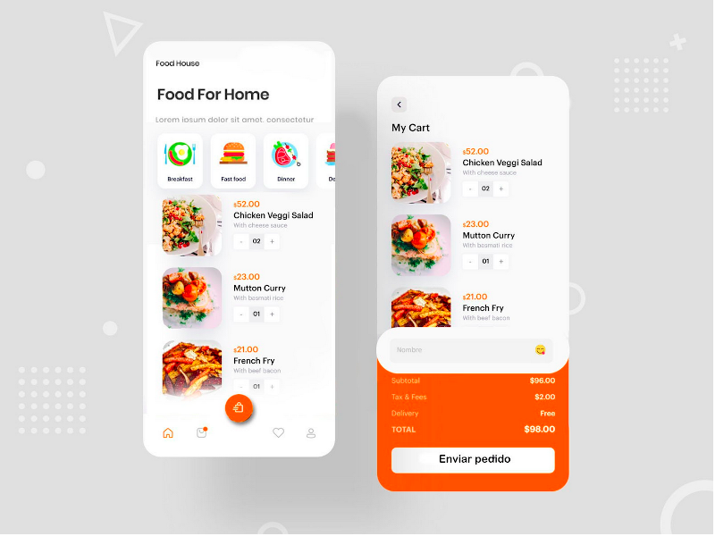

# Food App

A app to serve a menu for restaurants who during this time of covid have to provide takeway service in order to stay in bussiness.

## Description

A bootcamp individual project. We're learning about atomic design, web development by components. 


## Project Requirements
 - Develop a dynamic app with just HTML, CSS and vanila Javascript.
 - Recreat the model design provided by the teacher;
 - Design just for Mobile;
 - Users can add products to the basket and send their order as a Whatsapp message using its API.
 - Use local storage for persistence (not implemented yet)


## Reflection
- First I created all the components following the principles of atomic design: Atoms, Molecules, Organisms, Templates and pages;
- Style all the components individually.
- Since the project was quiet simple in terms of requeriments, I decided apply Test Driven Development in terms of business logic. I wanted to refresh my skills using a Javascript testing library and choose Jasmine because it was the one I was familiar with.
- I also followed the Object Oriented Programming by creating class for the main elements Product and Basket and UI templates (Menu options, Menu and Basket)

## Screen Shots, Demo
#### Model Design provided by the teacher



#### My solution


## Getting Started

```bash
npm install
```
## Run the Tests

```bash
npm test
```